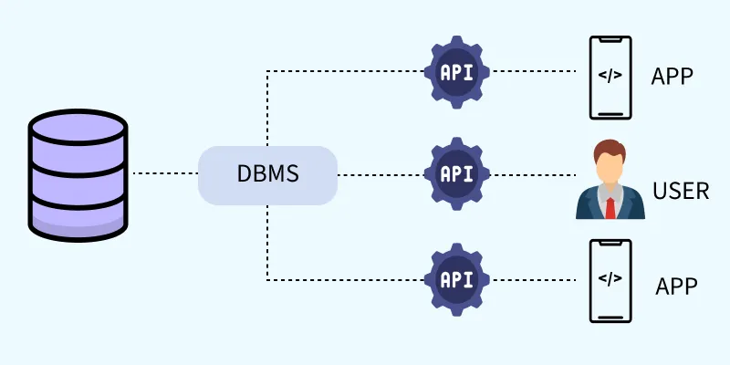

# BUỔI 1: NHẬP MÔN CSDL
---
## 1. CSDL là gì ?
### 1.1. Khái niệm 
- **Khái niệm:** Là một tập hợp có tổ chức cac thông tin/dữ liệu có cấu trúc
- **Hình thức lưu trữ:** dữ liệu được lưu dữ dưới dạng điện tử trong hệ thống máy tính và được vận hành thông qua Hệ quản trị cơ sở dữ liệu(DBMS - Database Mangaement System)
- **Tính năng cơ bản:** cho phép người dùng thực hiện các thao tác tìm kiếm, sắp xếp và cập nhật dữ liệu một cách linh hoạt
### 1.2. Cấu trúc và Cách thức hoạt động
- **Mô hình lưu trữ:** Dữ liệu trong CSDL thường được sắp xếp dưới dạng hàng và cột trong các bảng.
- M**ục đích cấu trúc:** Cách tổ chức này giúp tối ưu hóa khả năng xử lý và truy xuất dữ liệu một cách nhanh chóng.
- **Công cụ tương tác:** Để làm việc và giao tiếp với CSDL, người dùng thường sử dụng các ngôn ngữ lập trình chuyên dụng, phổ biến nhất là SQL (Structured Query Language).
### 1.3. So sánh Cơ sở dữ liệu (Database) và Bảng tính (Spreadsheet)
- Mặc dù đều dùng để lưu trữ và quản lý thông tin, CSDL có nhiều điểm vượt trội so với các bảng tính thông thường (như Excel, Google Sheets):

| **Tiêu chí** | **Bảng tính** | **Cơ sở dữ liệu** |
|:---|:---|:---|
| **Dung lượng & Quy mô** | Hạn chế, phù hợp với lượng dữ liệu vừa và nhỏ. | Khả năng lưu trữ **lớn hơn rất nhiều**, đáp ứng dữ liệu khổng lồ. |
| **Khả năng truy cập** | Thường giới hạn số lượng người chỉnh sửa đồng thời. | Cho phép **nhiều người dùng truy cập và thao tác cùng lúc**, hạn chế xung đột. |
| **Độ phức tạp & Hiệu năng** | Tốc độ giảm khi dữ liệu tăng cao. | Được tối ưu cho việc xử lý và truy vấn dữ liệu phức tạp. |
---
## 2. Hệ quản trị CSDL là gì ?
### 2.1. DBMS là gì?
- DBMS (Data Mangement System) - Hệ quản trị cơ sở dữ liệu - là một hệ thống phần mềm dùng để tạo, lưu trữ, quản lý, truy xuất và thao tác với dữ liệu trong cơ swor dữ liệu một cách hiệu quả.
- DBMS đóng vai trò trung gian giữa người dùng/ứng dụng và cơ sở dữ liệu.




**Chức năng chính của DBMS**
- Lưu trữ dữ liệu: Tổ chức và lưu trữ dữ liệu có cấu trúc.
- Truy xuất dữ liệu: Cho phép tìm kiếm và lấy dữ liệu nhanh chóng.
- Thao tác dữ liệu: Thêm, sửa, xóa dữ liệu.
- Đảm bảo tính toàn vẹn: Đảm bảo dữ liệu chính xác và nhất quán.
- Bảo mật: Kiểm soát quyền truy cập dữ liệu.
- Hỗ trợ nhiều người dùng: Cho phép nhiều người dùng truy cập và thao tác đồng thời.
- Quản lý giao dịch: Đảm bảo các thao tác dữ liệu được thực hiện an toàn.
- Sao lưu và phục hồi: Hỗ trợ backup và recovery khi xảy ra sự cố.
- Giảm dư thừa dữ liệu: Quản lý tập trung giúp hạn chế dữ liệu bị trùng lặp.

### 2.2. Hạn chế của hệ thống quản lý bằng File
Trước khi DBMS phổ biến, dữ liệu thường được lưu trữ bằng các file riêng biệt trên máy tính.
Ví dụ, một trường đại học có thể lưu:
```
SinhVien.txt
Diem.txt
HocBong.txt
KyTucXa.txt
```
Cách quản lý này gây ra nhiều vấn đề:
| **Vấn đề**                      | **Giải thích**                                                |
| :------------------------------ | :------------------------------------------------------------ |
| **Dư thừa dữ liệu**             | Cùng một thông tin có thể xuất hiện ở nhiều file.             |
| **Không nhất quán**             | Một thông tin được sửa ở file này nhưng chưa sửa ở file khác. |
| **Khó truy cập**                | Phải tìm kiếm và xử lý nhiều file thủ công.                   |
| **Bảo mật kém**                 | Khó kiểm soát ai được phép xem hoặc sửa dữ liệu.              |
| **Khó hỗ trợ nhiều người dùng** | Nhiều người cùng sửa dữ liệu dễ xảy ra xung đột.              |
| **Khó sao lưu và phục hồi**     | Khi file bị hỏng hoặc mất, việc khôi phục rất khó.            |
### 2.3. Các thành phần của một hệ thống DBMS
Một hệ thống DBMS thường gồm 6 thành phần chính:

| **Thành phần**               | **Ý nghĩa**                                                |
| :--------------------------- | :--------------------------------------------------------- |
| **Hardware**                 | Máy chủ, ổ đĩa, RAM, thiết bị mạng,...                     |
| **Software**                 | DBMS, hệ điều hành và các phần mềm liên quan.              |
| **Data**                     | Dữ liệu được lưu trữ và quản lý.                           |
| **Procedures**               | Quy trình, quy tắc sử dụng và quản lý hệ thống.            |
| **Database Access Language** | Ngôn ngữ dùng để tương tác với CSDL, phổ biến nhất là SQL. |
| **People**                   | Những người sử dụng và quản trị hệ thống.                  |

---
## 3. Câu lệnh tạo database, table trong MS SQL Server
### 3.1. Tạo Database
Sử dụng câu lệnh CREATE DATABASE để tạo một cơ sở dữ liệu mới.
```sql
CREATE DATABASE TenDatabase;
```
Ví dụ: 
```sql
CREATE DATABASE QuanLySinhVien;
```
### 3.2. Tạo Table
Sử dụng câu lệnh CREATE TABLE để tạo một bảng trong Database.

Cú pháp:
```sql
CREATE TABLE TenTable (
    TenCot1 KieuDuLieu,
    TenCot2 KieuDuLieu,
    TenCot3 KieuDuLieu
);
```
Ví dụ tạo bảng Students:
```sql
CREATE TABLE Students (
    student_id INT PRIMARY KEY,
    name VARCHAR(100),
    age INT
);
```
Bảng sẽ có dạng:
| **Tên cột**  | **Kiểu dữ liệu** | **Ràng buộc** |
| :----------- | :--------------- | :------------ |
| `student_id` | `INT`            | `PRIMARY KEY` |
| `name`       | `VARCHAR(100)`   | —             |
| `age`        | `INT`            | —             |
