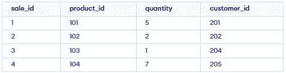

# Buổi 4: SQL nâng cao

## 1. Tối ưu truy vấn

Truy vấn SQL viết không tốt có thể làm chậm database, tốn nhiều tài nguyên, gây ra vấn đề khóa (locking) và ảnh hưởng xấu đến trải nghiệm người dùng. Việc tuân theo các best practice khi viết truy vấn giúp cải thiện hiệu năng database và sử dụng tài nguyên hệ thống một cách tối ưu.

- Giảm thời gian thực thi truy vấn và cải thiện hiệu năng tổng thể.
- Giảm thiểu tiêu tốn tài nguyên, tránh các vấn đề khóa và nghẽn (blocking).

### 1.1. Sử dụng Index một cách hợp lý

Index giúp database tìm dữ liệu nhanh hơn mà không cần quét toàn bộ bảng.

**Ví dụ:** Tạo index trên cột `customer_id` nếu thường xuyên truy vấn theo cột này.

```sql
SELECT * FROM orders WHERE customer_id = 123;
```

Tạo index trên `customer_id` giúp truy vấn trên chạy nhanh hơn nhiều:

```sql
CREATE INDEX idx_orders_customer_id ON orders(customer_id);
```

**Các loại index:**

- **Primary Index:** Tự động tạo trên khóa chính (primary key); đảm bảo giá trị duy nhất và truy cập nhanh.
- **Secondary Index:** Tạo trên các cột không phải khóa chính để cải thiện hiệu năng truy vấn. Cần tạo thủ công.
- **Clustered Index:** Quyết định cách dữ liệu được sắp xếp trong bảng; chỉ có một clustered index trên mỗi bảng. Ở một số hệ quản trị CSDL, primary index tự động là clustered.
- **Non-Clustered Index:** Chứa con trỏ trỏ đến dữ liệu thực; có thể có nhiều non-clustered index trên một bảng.

**Nguyên tắc khi đánh index:**

- Đánh index cho các cột thường dùng trong `WHERE`, `JOIN`, hoặc `ORDER BY`.
- Tránh tạo quá nhiều index — vì sẽ làm chậm các thao tác `INSERT`, `UPDATE`, `DELETE`.
- Thường xuyên kiểm tra và theo dõi việc sử dụng index để đảm bảo truy vấn luôn nhanh.

### 1.2. Tránh dùng SELECT *: Chỉ chọn các cột cần thiết

Dùng `SELECT *` có thể làm truy vấn chậm, đặc biệt với bảng lớn hoặc khi join nhiều bảng. Vì database phải lấy toàn bộ cột, kể cả những cột không cần dùng, gây tốn bộ nhớ, tốn thời gian truyền dữ liệu và khiến truy vấn khó tối ưu hơn.

Nên tránh:

```sql
SELECT * FROM products;
```

Nên dùng:

```sql
SELECT product_id, product_name, price FROM products;
```

**Lợi ích:**
- Tốn ít bộ nhớ hơn và chạy nhanh hơn.
- Cho phép database bỏ qua các cột không cần thiết.
- Truy vấn đơn giản và dễ đọc hơn.

### 1.3. Giới hạn số dòng với WHERE và LIMIT

Lấy quá nhiều dòng dữ liệu sẽ làm truy vấn chậm. Kể cả khi ứng dụng chỉ cần 10 dòng, database vẫn có thể trả về hàng nghìn dòng nếu không giới hạn. Dùng `WHERE` để lọc dữ liệu và `LIMIT` để chỉ lấy số dòng cần thiết.

**Ví dụ:**

```sql
SELECT name FROM customers 
WHERE country = 'USA' 
ORDER BY signup_date DESC 
LIMIT 50;
```

**Lợi ích:**
- Truy vấn nhanh hơn, tốn ít CPU hơn.
- Chỉ truyền dữ liệu cần thiết, tránh quá tải.
- Hữu ích khi test hoặc xem trước kết quả.

### 1.4. Viết mệnh đề WHERE hiệu quả

Mệnh đề `WHERE` dùng để lọc dòng dữ liệu, nhưng cách viết ảnh hưởng lớn đến hiệu năng. Việc dùng hàm hoặc phép tính trên cột có thể khiến database không sử dụng được index, làm truy vấn chậm đi.

Ví dụ chưa tối ưu:

```sql
SELECT * FROM employees WHERE YEAR(joining_date) = 2022;
```

Nhược điểm: Áp dụng `YEAR()` cho từng dòng khiến database không dùng được index.

Ví dụ đã tối ưu:

```sql
SELECT * FROM employees 
WHERE joining_date >= '2022-01-01' AND joining_date < '2023-01-01';
```

**Mẹo tối ưu hiệu năng:**
- Không dùng hàm trên cột (`YEAR()`, `LOWER()`, ...).
- Tránh thực hiện phép tính trên cột (ví dụ: `salary + 5000 = 100000`).
- Viết điều kiện sao cho index có thể được sử dụng hiệu quả.

### 1.5. Sử dụng JOIN thông minh

Chỉ join những bảng thực sự cần thiết và lọc dữ liệu trước khi join. Dùng `INNER JOIN` thay vì `OUTER JOIN` nếu không cần các dòng không khớp.

**Ví dụ:**

```sql
SELECT u.name, o.amount
FROM users u
JOIN orders o ON u.user_id = o.user_id
WHERE o.amount > 100;
```

**Lợi ích:**
- Xử lý join nhanh hơn.
- `INNER JOIN` kết hợp các dòng dựa trên điều kiện khớp bằng `ON`, chỉ trả về các bản ghi liên quan.
- Giúp database chọn được kế hoạch thực thi (execution plan) hiệu quả hơn.

### 1.6. Tránh vấn đề N+1 Query

Vấn đề N+1 xảy ra khi chạy một truy vấn để lấy danh sách, sau đó chạy thêm truy vấn riêng cho từng phần tử. Thay vào đó, nên lấy dữ liệu liên quan trong một truy vấn duy nhất bằng `JOIN`.

Cách làm chưa tối ưu:

```sql
SELECT * FROM users;
-- Với mỗi user: SELECT * FROM orders WHERE user_id = ?
```

Cách làm được khuyến nghị:

```sql
SELECT u.user_id, u.name, o.order_id, o.amount
FROM users u
JOIN orders o ON u.user_id = o.user_id;
```

**Lợi ích:**
- Giảm số lần gọi database.
- Thời gian phản hồi nhanh hơn.
- Giảm tải cho database.

### 1.7. Dùng EXISTS thay vì IN (với subquery)

Khi cần kiểm tra một bản ghi có tồn tại trong bảng khác hay không, dùng `EXISTS` thường nhanh hơn `IN`, đặc biệt khi subquery trả về nhiều dòng, vì `EXISTS` dừng lại ngay khi tìm thấy bản ghi khớp đầu tiên, còn `IN` phải xử lý toàn bộ kết quả rồi mới so sánh.

Cách làm chưa tối ưu:

```sql
SELECT name FROM customers
WHERE customer_id IN (SELECT customer_id FROM orders);
```

Cách làm được khuyến nghị:

```sql
SELECT name FROM customers
WHERE EXISTS (
  SELECT 1 FROM orders WHERE orders.customer_id = customers.customer_id
);
```

**Lợi ích:**
- Dừng tìm kiếm ngay khi có kết quả khớp.
- Tốn ít bộ nhớ hơn với subquery lớn.
- Thường nhanh hơn và được tối ưu tốt hơn.

### 1.8. Tránh dùng ký tự đại diện (%) ở đầu LIKE

Không nên đặt `%` ở đầu pattern trong `LIKE` vì nó khiến database không dùng được index, dẫn đến quét toàn bộ bảng (full table scan).

Cách làm chưa tối ưu:

```sql
SELECT * FROM users WHERE name LIKE '%john';
```

Cách làm được khuyến nghị:

```sql
SELECT * FROM users WHERE name LIKE 'john%';
```

**Lợi ích:**
- Giữ tốc độ tìm kiếm nhanh, tận dụng được index.
- Giảm chi phí quét dữ liệu.

### 1.9. Sử dụng Query Execution Plan

Kiểm tra cách database thực thi truy vấn bằng `EXPLAIN` (MySQL/PostgreSQL) để phát hiện các phần chạy chậm.

**Ví dụ:**

```sql
EXPLAIN SELECT * FROM orders WHERE user_id = 42;
```

**Lợi ích:**
- Giúp phát hiện các trường hợp quét toàn bộ bảng (full table scan).
- Cho biết index có được sử dụng hay không.
- Hỗ trợ đưa ra quyết định tối ưu truy vấn.

### 1.10. Dùng UNION ALL thay vì UNION (nếu có thể)

`UNION` sẽ loại bỏ các dòng trùng lặp, gây thêm chi phí sắp xếp (sorting). Nếu không quan tâm đến việc trùng lặp, nên dùng `UNION ALL`.

Cách làm chưa tối ưu:

```sql
SELECT col FROM table1
UNION
SELECT col FROM table2;
```

Cách làm được khuyến nghị:

```sql
SELECT col FROM table1
UNION ALL
SELECT col FROM table2;
```

**Lợi ích:**
- Tránh việc sắp xếp không cần thiết.
- Gộp kết quả nhanh hơn.
- Phù hợp hơn với tập dữ liệu lớn.

## 2. Sử dụng index

Index trong SQL là cấu trúc dữ liệu đặc biệt giúp cải thiện hiệu năng truy vấn bằng cách cho phép truy cập dữ liệu nhanh hơn thay vì phải quét toàn bộ bảng. Index giúp truy xuất bản ghi hiệu quả hơn và nâng cao hiệu năng tổng thể của database.

> **Lưu ý:** Ràng buộc `PRIMARY KEY` và `UNIQUE` sẽ tự động tạo index.

### 2.1. Tạo Index

Có ba cách chính để tạo index trong SQL, mỗi cách phục vụ mục đích khác nhau tùy theo cách dữ liệu được truy cập và tổ chức trong bảng. Index giúp cải thiện hiệu năng truy vấn bằng cách cho phép truy xuất dữ liệu nhanh hơn.

**a. Single Column Index (Index trên một cột)**

Single-column index được tạo trên chỉ một cột. Đây là loại index cơ bản nhất, giúp tăng tốc truy vấn khi thường xuyên tìm kiếm, lọc hoặc sắp xếp theo cột đó.

Cú pháp:

```sql
CREATE INDEX index_name 
ON table_name (column);
```

Ví dụ: Trước tiên, tạo một database và bảng demo trong SQL để áp dụng Index.


```sql
CREATE INDEX idx_product_id 
ON sales (product_id);
```

**b. Multi Column Index (Index trên nhiều cột)**

Multi-column index được tạo trên hai cột trở lên. Loại index này giúp cải thiện hiệu năng khi truy vấn lọc hoặc join dựa trên nhiều cột cùng lúc.

Cú pháp:

```sql
CREATE INDEX index_name 
ON table_name (column1, column2, .....);
```

Ví dụ:

```sql
CREATE INDEX idx_product_quantity 
ON sales (product_id, quantity);
```

**c. Unique Index (Index duy nhất)**

Unique index đảm bảo tất cả các giá trị trong một cột (hoặc tổ hợp nhiều cột) là duy nhất, ngăn chặn dữ liệu trùng lặp và giữ toàn vẹn dữ liệu.

Cú pháp:

```sql
CREATE UNIQUE INDEX index_name 
ON table_name (column_name);
```

Ví dụ:

```sql
CREATE UNIQUE INDEX idx_unique_employee_id 
ON sales (customer_id);
```

Nếu cố gắng thêm một bản ghi trùng lặp:

```sql
INSERT INTO sales (sale_id, product_id, quantity, customer_id)
VALUES (6, 105, 4, 201);
```

Câu lệnh trên sẽ báo lỗi vì `customer_id = 201` đã tồn tại.

### 2.2. Kiểm tra và xem thông tin Index

Có thể xem các index của một bảng để kiểm tra tên và cấu trúc của chúng bằng thủ tục hệ thống `sp_helpindex`.

Cú pháp:

```sql
EXEC sp_helpindex 'table_name';
```

Ví dụ:

```sql
EXEC sp_helpindex 'sales';
```

### 2.3. Xóa Index

Index chiếm dung lượng lưu trữ và tạo thêm overhead cho các thao tác ghi (`INSERT`, `UPDATE`, `DELETE`). Nếu một index không còn cần thiết, có thể xóa nó đi.

Cú pháp:

```sql
DROP INDEX index_name 
ON table_name;
```

Ví dụ:

```sql
DROP INDEX idx_product_quantity 
ON sales; 
```

### 2.4. Sửa đổi (Alter) Index

Nếu một index cần được điều chỉnh, chẳng hạn tổ chức lại hoặc xây dựng lại (rebuild), có thể thực hiện mà không ảnh hưởng đến dữ liệu. Việc này hữu ích để tối ưu hiệu năng index khi bảng ngày càng lớn.

Cú pháp:

```sql
ALTER INDEX index_name  
ON table_name REBUILD;
```

Ví dụ:

```sql
ALTER INDEX idx_product_id 
ON sales REBUILD;
```

### 2.5. Đổi tên Index

Trong một số trường hợp, việc đổi tên index có thể cần thiết để rõ ràng hoặc nhất quán hơn. SQL không hỗ trợ trực tiếp việc đổi tên index, nhưng có thể dùng thủ tục hệ thống để thực hiện.

Cú pháp:

```sql
EXEC sp_rename 'old_index_name', 'new_index_name', 'INDEX';
```

Ví dụ:

```sql
EXEC sp_rename 'idx_product_quantity', 'idx_prod_qty', 'INDEX'; 
```

## 3. Khái niệm Transaction, ACID, dirty read, dirty write

### 3.1. Transaction

Một **transaction (giao dịch)** trong SQL gom nhiều thao tác SQL (ví dụ: `INSERT`, `UPDATE`, `DELETE`) thành một đơn vị làm việc duy nhất nhằm đảm bảo xử lý dữ liệu đáng tin cậy. Transaction đảm bảo rằng tất cả các thao tác đều được hoàn thành thành công, hoặc không có thao tác nào được áp dụng, từ đó giữ toàn vẹn dữ liệu.

- Đảm bảo tính nhất quán bằng cách lưu (commit) tất cả thay đổi cùng lúc.
- Tự động hoàn tác (rollback) các thay đổi nếu có bất kỳ thao tác nào thất bại.

#### 3.1.1. Các lệnh điều khiển Transaction (Transaction Control Commands)

Các lệnh điều khiển transaction dùng để quản lý transaction và kiểm soát thời điểm lưu hoặc hoàn tác thay đổi.

**a. Lệnh BEGIN TRANSACTION**

Bắt đầu một transaction mới. Tất cả các câu lệnh SQL sau lệnh này được xem là một phần của cùng một transaction cho đến khi có `COMMIT` hoặc `ROLLBACK`.

Cú pháp:

```sql
BEGIN TRANSACTION transaction_name;
```

**Ví dụ:** Giao dịch chuyển tiền ngân hàng giữa hai tài khoản, minh họa việc sử dụng nhiều câu lệnh trong một transaction.

```sql
BEGIN TRANSACTION;

-- trừ 150 từ tài khoản a
UPDATE accounts
SET balance = balance - 150
WHERE account_id = 'A';

-- cộng 150 vào tài khoản b
UPDATE accounts
SET balance = balance + 150
WHERE account_id = 'B';

-- lưu (commit) transaction nếu cả hai thao tác thành công
COMMIT;
```

- Cả hai câu lệnh `UPDATE` được thực thi như một phần của cùng một transaction.
- Nếu tất cả các cập nhật thành công, `COMMIT` sẽ lưu vĩnh viễn các thay đổi.
- Nếu có bất kỳ cập nhật nào thất bại, `ROLLBACK` sẽ hủy toàn bộ thay đổi để đảm bảo tính nhất quán.

```sql
ROLLBACK;
```

**b. Lệnh COMMIT**

Lệnh `COMMIT` dùng để lưu tất cả các thay đổi được thực hiện trong transaction hiện tại vào database. Sau khi transaction được commit, các thay đổi là vĩnh viễn.

Cú pháp:

```sql
COMMIT;
```

**Ví dụ:** Bảng `student` chứa các thông tin cơ bản như `id`, `name`, `age`, dùng để minh họa các lệnh transaction như `SAVEPOINT`, `ROLLBACK`, `RELEASE`.

Ví dụ xóa các bản ghi có `age = 20` rồi `COMMIT` thay đổi vào database:

```sql
DELETE FROM student WHERE age = 20;
COMMIT;
```

- Các dòng có `age = 20` bị xóa.
- Việc xóa lúc này là vĩnh viễn và không thể hoàn tác.

**c. Lệnh ROLLBACK**

Lệnh `ROLLBACK` hoàn tác tất cả các thay đổi trong transaction hiện tại, hữu ích khi có lỗi xảy ra hoặc muốn hủy các thay đổi. Database sẽ quay về trạng thái trước khi `BEGIN TRANSACTION` được thực thi.

Cú pháp:

```sql
ROLLBACK;
```

Ví dụ:

```sql
DELETE FROM student WHERE age = 20;
ROLLBACK;
```

- Các dòng có `age = 20` bị xóa tạm thời.
- `ROLLBACK` khôi phục bảng về trạng thái ban đầu trước khi xóa.

**d. Lệnh SAVEPOINT**

`SAVEPOINT` giống như một điểm đánh dấu bên trong transaction. Nó cho phép quay lại một điểm cụ thể mà không cần hủy toàn bộ transaction.

Cú pháp:

```sql
SAVEPOINT SAVEPOINT_NAME;
```

Ví dụ:

```sql
SAVEPOINT SP1;
DELETE FROM student WHERE age = 20;
SAVEPOINT SP2;
```

- Tạo `SP1` trước khi xóa.
- Xóa các sinh viên có `age = 20`.
- Tạo `SP2` sau khi xóa.

**e. Lệnh ROLLBACK TO SAVEPOINT**

Lệnh `ROLLBACK TO SAVEPOINT` cho phép hoàn tác transaction về một savepoint cụ thể, tức là hủy các thay đổi được thực hiện sau điểm đó.

Cú pháp:

```sql
ROLLBACK TO SAVEPOINT SAVEPOINT_NAME;
```

Ví dụ:

```sql
ROLLBACK TO SP1;
```

- Hoàn tác lệnh xóa, các sinh viên có `age = 20` xuất hiện trở lại.
- Bảng quay về trạng thái tại thời điểm `SP1`.

**f. Lệnh RELEASE SAVEPOINT**

`RELEASE SAVEPOINT` xóa bỏ một savepoint để không thể rollback về điểm đó nữa. Lệnh này giúp quản lý transaction và các thay đổi của nó.

Cú pháp:

```sql
RELEASE SAVEPOINT SAVEPOINT_NAME;
```

Ví dụ:

```sql
RELEASE SAVEPOINT SP2; -- giải phóng savepoint thứ hai
```

- Savepoint đã được giải phóng.
- `SP2` không còn tồn tại.
- Không thể thực hiện `ROLLBACK TO SP2` nữa.
- Bảng không thay đổi, vẫn giữ nguyên trạng thái sau lần rollback gần nhất.

**Ví dụ thực tế:** Trong hệ thống ngân hàng, transaction đảm bảo việc chuyển tiền an toàn bằng cách đảm bảo tất cả các bước đều thành công hoặc tất cả đều thất bại, giữ cho dữ liệu luôn nhất quán.

#### 3.1.2. Các loại Transaction trong SQL

Có nhiều loại transaction khác nhau tùy theo bản chất và thao tác cụ thể mà chúng thực hiện:

- **Read Transactions (Giao dịch đọc):** Chỉ dùng để đọc dữ liệu, thường bằng câu lệnh `SELECT`.
- **Write Transactions (Giao dịch ghi):** Liên quan đến việc thay đổi dữ liệu bằng `INSERT`, `UPDATE` hoặc `DELETE`.
- **Distributed Transactions (Giao dịch phân tán):** Trải rộng trên nhiều database, đảm bảo tính nhất quán giữa các database đó.
- **Implicit Transactions (Giao dịch ngầm định):** Tự động được bắt đầu bởi SQL Server cho một số thao tác nhất định.
- **Explicit Transactions (Giao dịch tường minh):** Transaction được kiểm soát thủ công, người dùng tự bắt đầu và kết thúc bằng `BEGIN TRANSACTION`, `COMMIT` và `ROLLBACK`.

#### 3.1.3. Tối ưu Transaction

Tuân theo các best practice sau giúp cải thiện hiệu năng transaction và giảm rủi ro xung đột:

- Theo dõi khóa (lock) để tránh xung đột và deadlock.
- Giữ transaction nhỏ gọn để cải thiện hiệu năng.
- Sử dụng batching khi xử lý các thao tác dữ liệu lớn để đạt hiệu quả cao hơn.

### 3.2. ACID

Transaction là thao tác cơ bản cho phép chúng ta thay đổi và truy xuất dữ liệu. Tuy nhiên, để đảm bảo tính toàn vẹn của database, các transaction cần được thực thi sao cho duy trì được tính nhất quán, chính xác và tin cậy, ngay cả khi xảy ra lỗi hoặc sự cố. Đây chính là lý do các thuộc tính **ACID** ra đời.

#### 3.2.1. Atomicity (Tính nguyên tử)

Atomicity nghĩa là một transaction hoặc thực hiện toàn bộ, hoặc không thực hiện gì cả — tất cả các thao tác đều thành công, hoặc không có thao tác nào được áp dụng. Nếu bất kỳ phần nào thất bại, toàn bộ transaction sẽ được rollback để giữ database ở trạng thái nhất quán.

- **Commit:** Nếu transaction thành công, các thay đổi được áp dụng vĩnh viễn.
- **Abort/Rollback:** Nếu transaction thất bại, mọi thay đổi trong quá trình thực hiện sẽ bị hủy bỏ.

**Ví dụ:** Xét transaction T gồm hai phần T1 và T2: chuyển $100 từ tài khoản X sang tài khoản Y. Nếu transaction thất bại sau khi hoàn thành T1 nhưng trước khi hoàn thành T2, database sẽ rơi vào trạng thái không nhất quán. Với Atomicity, nếu bất kỳ phần nào của transaction thất bại, toàn bộ quá trình sẽ được rollback về trạng thái ban đầu, không có thay đổi nào được áp dụng một phần.

#### 3.2.2. Consistency (Tính nhất quán)

Consistency trong transaction nghĩa là database phải luôn ở trạng thái hợp lệ, cả trước và sau khi transaction diễn ra.

- Trạng thái hợp lệ là trạng thái tuân theo tất cả các quy tắc, ràng buộc và mối quan hệ đã định nghĩa (như khóa chính, khóa ngoại, v.v.).
- Nếu một transaction vi phạm bất kỳ quy tắc nào, nó sẽ bị rollback để tránh dữ liệu bị hỏng hoặc không hợp lệ.
- Nếu một transaction trừ tiền từ tài khoản này nhưng không cộng vào tài khoản kia (trong giao dịch chuyển tiền), nó vi phạm tính nhất quán.

**Ví dụ:** Giả sử tổng số dư của tất cả tài khoản trong hệ thống ngân hàng luôn phải là một hằng số. Trước khi chuyển tiền, tổng số dư là $700. Sau giao dịch, tổng số dư vẫn phải là $700. Nếu transaction thất bại giữa chừng (ví dụ cập nhật một tài khoản nhưng không cập nhật tài khoản còn lại), hệ thống cần duy trì tính nhất quán bằng cách rollback transaction.

- Tổng trước khi T xảy ra = 500 + 200 = 700.
- Tổng sau khi T xảy ra = 400 + 300 = 700.

#### 3.2.3. Isolation (Tính cô lập)

Isolation đảm bảo các transaction chạy độc lập mà không ảnh hưởng lẫn nhau. Thay đổi do một transaction thực hiện sẽ không hiển thị với các transaction khác cho đến khi được commit.

Isolation đảm bảo kết quả của các transaction chạy đồng thời giống như khi chúng được chạy tuần tự lần lượt, giúp tránh các vấn đề như:

- **Dirty reads:** đọc dữ liệu chưa được commit.
- **Non-repeatable reads:** dữ liệu thay đổi giữa hai lần đọc.
- **Phantom reads:** xuất hiện dòng dữ liệu mới trong quá trình transaction đang chạy.

**Ví dụ:** Xét hai transaction T và T''. Ban đầu X = 500, Y = 500.

1. **Transaction T:** T muốn chuyển $50 từ X sang Y. T đọc Y (giá trị 500), trừ $50 từ X (X mới = 450), và cộng $50 vào Y (Y mới = 550).
2. **Transaction T'':** T'' bắt đầu và đọc X (500) và Y (500), tính tổng: 500 + 500 = 1000. Trong khi đó, giá trị X và Y đã thay đổi thành 450 và 550. Vì vậy, tổng đúng phải là 450 + 550 = 1000.

Isolation đảm bảo T'' không đọc các giá trị cũ trong khi transaction khác (T) vẫn đang thực hiện. Các transaction cần độc lập với nhau, và T'' chỉ nên truy cập giá trị cuối cùng sau khi T đã commit. Điều này tránh được kết quả không nhất quán, như phép tính tổng sai của T''.

#### 3.2.4. Durability (Tính bền vững)

Durability đảm bảo rằng một khi transaction đã được commit, các thay đổi của nó sẽ được lưu vĩnh viễn, ngay cả khi hệ thống gặp sự cố. Dữ liệu được lưu trong bộ nhớ không biến động (non-volatile memory), nên database có thể khôi phục về trạng thái commit gần nhất mà không bị mất dữ liệu.

**Ví dụ:** Sau khi chuyển tiền thành công từ Tài khoản A sang Tài khoản B, các thay đổi được lưu trên đĩa. Ngay cả khi hệ thống gặp sự cố ngay sau khi commit, thông tin giao dịch vẫn còn nguyên vẹn khi hệ thống khôi phục, đảm bảo tính bền vững.

#### 3.2.5. ACID ảnh hưởng như thế nào đến thiết kế và vận hành DBMS

Tổng hợp lại, các thuộc tính ACID cung cấp một cơ chế đảm bảo tính đúng đắn và nhất quán của database, sao cho mỗi transaction là một nhóm thao tác hoạt động như một đơn vị duy nhất, cho ra kết quả nhất quán, hoạt động cô lập với các thao tác khác, và các cập nhật được lưu trữ bền vững.

**a. Toàn vẹn và nhất quán dữ liệu**

ACID bảo vệ tính toàn vẹn dữ liệu của DBMS bằng cách đảm bảo transaction hoặc hoàn thành thành công, hoặc không để lại dấu vết nào nếu bị gián đoạn. Điều này ngăn chặn các cập nhật một phần làm hỏng dữ liệu, và đảm bảo database chỉ chuyển giữa các trạng thái hợp lệ.

**b. Kiểm soát đồng thời (Concurrency Control)**

ACID cung cấp nền tảng vững chắc để quản lý các transaction chạy đồng thời. Isolation đảm bảo các transaction không can thiệp lẫn nhau, ngăn chặn các bất thường dữ liệu như mất cập nhật (lost updates), tình trạng không nhất quán tạm thời, và dữ liệu chưa commit.

**c. Khôi phục và chịu lỗi (Recovery and Fault Tolerance)**

Durability đảm bảo rằng ngay cả khi hệ thống gặp sự cố (crash), database vẫn có thể khôi phục về trạng thái nhất quán. Nhờ các thuộc tính Atomicity và Durability, nếu một transaction thất bại giữa chừng, database vẫn giữ được trạng thái nhất quán.

| Thuộc tính | Thành phần chịu trách nhiệm duy trì |
|---|---|
| Atomicity | Transaction Manager |
| Consistency | Lập trình viên ứng dụng (Application programmer) |
| Isolation | Concurrency Control Manager |
| Durability | Recovery |

#### 3.2.6. Các trường hợp ứng dụng quan trọng của ACID

Trong các ứng dụng hiện đại, việc đảm bảo độ tin cậy và tính nhất quán của dữ liệu là rất quan trọng. Thuộc tính ACID đóng vai trò nền tảng trong các lĩnh vực như:

- **Ngân hàng (Banking):** Các giao dịch chuyển tiền, gửi tiền, rút tiền phải duy trì tính nhất quán và bền vững nghiêm ngặt để tránh lỗi và gian lận.
- **Thương mại điện tử (E-commerce):** Đảm bảo số lượng tồn kho, đơn hàng, thông tin khách hàng được xử lý đúng và nhất quán, kể cả khi lưu lượng truy cập cao, đòi hỏi tuân thủ ACID.
- **Y tế (Healthcare):** Hồ sơ bệnh nhân, kết quả xét nghiệm, đơn thuốc phải tuân theo các tiêu chuẩn nghiêm ngặt về tính nhất quán, toàn vẹn và bảo mật.

### 3.3. Dirty read

**Dirty Read** trong SQL xảy ra khi một transaction đọc dữ liệu đã bị thay đổi bởi một transaction khác, nhưng chưa được commit. Nói cách khác, một transaction đọc dữ liệu chưa commit của transaction khác, có thể dẫn đến kết quả sai hoặc không nhất quán.

Tình huống này có thể xảy ra khi một transaction thay đổi một dữ liệu rồi bắt đầu transaction, nhưng không commit thay đổi do lỗi hệ thống, lỗi mạng hoặc sự cố khác. Nếu một transaction khác đọc dữ liệu đã thay đổi trước khi transaction đầu tiên kịp commit, sẽ dẫn đến dirty read.

Ví dụ: xét hai transaction T1 và T2. T1 sửa một dòng trong bảng và bắt đầu transaction, nhưng chưa commit. Trong khi đó, T2 cố đọc cùng dòng đó trước khi T1 commit thay đổi. Nếu T2 được phép đọc dữ liệu chưa commit này, sẽ dẫn đến dirty read, có thể gây ra kết quả sai hoặc không nhất quán.

#### 3.3.1. Các mức cô lập (Isolation Level) để ngăn Dirty Read

Để ngăn chặn dirty read, SQL cung cấp các mức cô lập transaction (transaction isolation level), quy định cách các transaction được cô lập với nhau:

- **Read uncommitted:** Cho phép transaction đọc dữ liệu chưa commit của transaction khác, dẫn đến khả năng xảy ra dirty read.
- **Read committed:** Chỉ cho phép transaction đọc dữ liệu đã commit, ngăn chặn dirty read.
- **Repeatable read:** Ngăn chặn dirty read và đảm bảo transaction luôn đọc cùng một dữ liệu cho một truy vấn nhất định, kể cả khi transaction khác thay đổi dữ liệu trong lúc đó.
- **Serializable:** Cung cấp mức cô lập cao nhất, đảm bảo các transaction được thực thi tuần tự, ngăn chặn dirty read và các bất thường khác.

Dirty read trong SQL có thể dẫn đến kết quả sai hoặc không nhất quán, và cần được ngăn chặn bằng cách sử dụng các mức cô lập transaction phù hợp. Có bốn loại vấn đề tương tranh (concurrency problem) phổ biến: dirty read, lost update, non-repeatable read và phantom read.

**Dirty Read** — xảy ra khi một transaction được phép đọc một dòng dữ liệu đã bị thay đổi bởi transaction khác nhưng chưa được commit. Nguyên nhân chủ yếu là do nhiều transaction chạy đồng thời mà chưa commit.

#### 3.3.2. Ví dụ minh họa

Bảng dữ liệu:

| ID | Cus_Name | Balance |
|---|---|---|
| 1 | S Adam | 100 |
| 2 | Zee Young | 150 |

Transaction: Chuyển 10 từ tài khoản của S Adam sang tài khoản của Zee Young.

```sql
BEGIN TRY
  BEGIN TRANSACTION
    UPDATE Table SET Balance = Balance - 10 WHERE ID=1;
    UPDATE Table SET Balance = Balance + 10 WHERE ID='C';
  COMMIT TRANSACTION
  PRINT 'Committed'
END TRY
BEGIN CATCH
  ROLLBACK TRANSACTION
  PRINT 'Not Committed'
END CATCH
```

Kết quả: **Not committed**

Khi thực thi truy vấn trên, kết quả sẽ là "Not committed" vì có lỗi — không tồn tại `ID='C'`. Lúc này, nếu có một transaction khác cố đọc dữ liệu ở dòng đó cùng thời điểm, dirty read sẽ xảy ra. Sẽ không có việc commit một phần — chỉ khi cả hai câu lệnh `UPDATE` đều thành công thì kết quả mới là "Committed".

**Giải thích thực tế:** Giả sử có một hệ thống đặt vé xe khách, một khách hàng đang đặt vé và tại thời điểm đó số ghế còn trống là 10. Trước khi khách hàng này hoàn tất thanh toán, khách hàng thứ hai muốn đặt vé — lúc này transaction thứ hai sẽ thấy số ghế còn trống là 9. Vấn đề là nếu khách hàng thứ nhất không đủ tiền trong thẻ hoặc ví, transaction đầu tiên sẽ bị rollback. Lúc đó, con số "9 ghế trống" mà transaction thứ hai đã đọc chính là dữ liệu dirty read.

**Ví dụ: Vé xe còn trống — với khách hàng thứ nhất**

*Bước 1:* Đọc dữ liệu ban đầu.

```sql
SELECT * FROM Bus_ticket;
```

| ID | Bus_Name | Available_Seat |
|---|---|---|
| 1 | KA0017 | 10 |

*Bước 2:* Thời điểm khách hàng thứ nhất đặt vé.

```sql
--Transaction 1
BEGIN Transaction
UPDATE Bus_Ticket set Available_Seat=9
WHERE ID=1

--Payment for Transaction 1
Waitfor Delay '00.00.30'
Rollback transaction 
```

*Bước 3:* Số vé còn trống mà khách hàng thứ hai đọc được trong khi khách hàng thứ nhất đang thanh toán.

```sql
--Transaction 2
set transaction isolation level read uncommitted
Select * from Bus_ticket where ID=1;
```

| ID | Bus_Name | Available_Seat |
|---|---|---|
| 1 | KA0017 | 9 |

Trong lúc khách hàng thứ nhất đang thanh toán, transaction thứ hai đọc được số ghế trống là 9. Nếu vì lý do nào đó transaction thứ nhất bị rollback, thì giá trị 9 mà transaction thứ hai đọc được chính là dữ liệu dirty read. Sau khi rollback transaction thứ nhất, số ghế trống lại quay về 10.

| ID | Bus_Name | Available_Seat |
|---|---|---|
| 1 | KA0017 | 10 |

#### 3.3.3. Ưu và nhược điểm của Dirty Read trong DBMS

**Ưu điểm:**
- Cho phép transaction đọc dữ liệu chưa commit, tăng khả năng xử lý đồng thời (concurrency) của hệ thống.
- Giảm chi phí khóa (locking overhead), vì không cần khóa khi đọc dữ liệu.
- Cải thiện thời gian phản hồi truy vấn, vì transaction không cần chờ transaction khác commit.

**Nhược điểm:**
- Có thể dẫn đến dữ liệu không nhất quán hoặc sai, vì dữ liệu đọc được có thể sau đó bị rollback.
- Tạo ra kết quả truy vấn không đáng tin cậy, vì dữ liệu có thể thay đổi trước khi transaction hoàn tất.
- Có thể gây ra vấn đề toàn vẹn dữ liệu, do đọc phải các cập nhật chưa hoàn chỉnh hoặc không nhất quán.
- Gây khó khăn cho việc debug, vì lỗi khó truy vết khi dữ liệu thay đổi ngoài dự kiến.

### 3.4. Dirty write

**Dirty Write** xảy ra khi một transaction ghi đè lên dữ liệu chưa được commit của một transaction khác. Nói cách khác, transaction thứ hai thay đổi dữ liệu mà transaction thứ nhất vừa mới sửa nhưng chưa commit — nếu sau đó transaction thứ nhất rollback, dữ liệu sẽ rơi vào trạng thái không nhất quán vì thay đổi của transaction thứ hai đã bị ghi đè lên một giá trị "ảo" (chưa từng thực sự tồn tại chính thức).

**Ví dụ minh họa:** Xét bảng `orders` với dòng `status = 'pending'`.

1. Transaction T1 cập nhật `status = 'processing'` nhưng chưa commit.
2. Transaction T2 đọc và ghi đè tiếp `status = 'shipped'` dựa trên giá trị `'processing'` mà T1 vừa ghi (chưa commit).
3. Nếu T1 rollback, giá trị `'processing'` không còn hợp lệ, nhưng T2 đã dựa vào đó để ghi `'shipped'`, khiến dữ liệu cuối cùng bị sai lệch và không nhất quán.

**Cách ngăn chặn Dirty Write:**

- Sử dụng mức cô lập `Read Committed` trở lên, vì các mức này không cho phép transaction đọc hoặc ghi đè dữ liệu chưa commit.
- Sử dụng cơ chế khóa (locking) phù hợp: khóa ghi (write lock) trên dòng dữ liệu đang được transaction khác chỉnh sửa, khiến các transaction khác phải chờ cho đến khi transaction đầu tiên commit hoặc rollback.
- Áp dụng kiểm soát tương tranh lạc quan (optimistic concurrency control) với version/timestamp để phát hiện xung đột ghi trước khi commit.

Dirty write được xem là vấn đề tương tranh nghiêm trọng hơn dirty read, vì nó không chỉ ảnh hưởng đến việc đọc dữ liệu mà còn trực tiếp làm sai lệch dữ liệu được ghi vào database, nên hầu hết các hệ quản trị CSDL hiện đại đều ngăn chặn dirty write ngay cả ở mức cô lập thấp nhất.