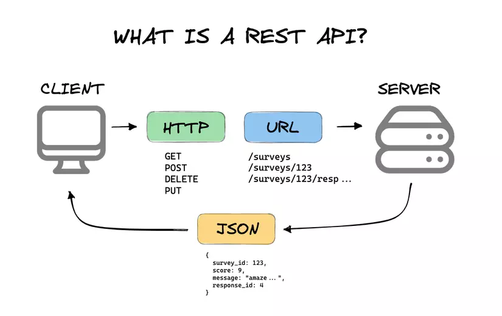
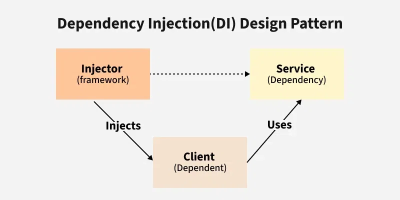

# HTTP, API, REST API & Design Pattern (DI, IoC)

## 1. HTTP là gì?

**HTTP** (HyperText Transfer Protocol) là một giao thức (protocol) - tức là một bộ quy tắc chuẩn - dùng để truyền tải dữ liệu giữa **client** (trình duyệt, ứng dụng) và **server** trên Internet.

**Cách hoạt động cơ bản:**
1. Client mở một kết nối TCP tới HTTP server, sau đó gửi một **Request** (yêu cầu) đến server
2. Request có thể được tạo trực tiếp (người dùng bấm vào một liên kết) hoặc gián tiếp (ví dụ: một video nhúng trong trang web sẽ tự động gửi thêm một request khác để tải video đó khi trang được mở)
3. Server xử lý và trả về một **Response** (phản hồi)
4. Đây là mô hình **stateless** (không trạng thái) - mỗi request độc lập, server không tự nhớ request trước đó của bạn (trừ khi dùng cookie, session, token...)

**Ví dụ thực tế:**
Khi gõ `google.com` lên trình duyệt:
- Trình duyệt (client) gửi HTTP Request đến server của Google
- Server Google xử lý, tìm trang chủ tương ứng
- Server trả về HTTP Response chứa HTML, CSS, JS để trình duyệt hiển thị trang web

**Lưu ý:** HTTPS là phiên bản bảo mật của HTTP (có mã hóa SSL/TLS), dùng cho các trang cần bảo mật như ngân hàng, đăng nhập...

---

## 2. Cấu trúc chi tiết của HTTP Request và Response

### 2.1. Cấu trúc HTTP Request

Một HTTP Request gồm 3 phần:

**a) Request-Line** — dòng đầu tiên, gồm 3 thông tin:
- **Method**: phương thức sử dụng (GET, POST, PUT, DELETE...)
- **URI**: địa chỉ định danh tài nguyên cần thao tác (ví dụ `/`, `/users/5`)
- **HTTP version**: phiên bản giao thức đang dùng (ví dụ HTTP/1.1)

Ví dụ: `GET /users/5 HTTP/1.1`

**b) Request-Header** — các thông tin bổ sung mà client gửi kèm, một số header thông dụng:

| Header | Ý nghĩa |
|---|---|
| `Accept` | Loại nội dung client có thể nhận (vd: `text/html`, `application/json`) |
| `Accept-Encoding` | Kiểu nén dữ liệu chấp nhận (vd: `gzip`, `deflate`) |
| `Connection` | Tùy chọn cho kết nối (vd: `keep-alive`) |
| `Cookie` | Thông tin cookie gửi kèm để duy trì phiên đăng nhập |
| `User-Agent` | Thông tin về trình duyệt/thiết bị của client |
| `Authorization` | Token xác thực (vd: `Bearer abc123`) |
| `Content-Type` | Định dạng dữ liệu gửi trong body (vd: `application/json`) |

**c) Message Body** (nếu có) — dữ liệu thực sự gửi kèm, thường dùng với POST, PUT, PATCH.

### 2.2. Cấu trúc HTTP Response

Tương tự Request nhưng dòng đầu là **Status-Line** thay vì Request-Line, gồm:
- **HTTP-version**: phiên bản cao nhất server hỗ trợ
- **Status-Code**: mã số kết quả xử lý
- **Reason-Phrase**: mô tả ngắn gọn ý nghĩa mã lỗi

Ví dụ: `HTTP/1.1 200 OK`

Sau đó là **Response-Header** (thông tin về response) và **Body** (dữ liệu trả về thực sự — HTML, JSON...).

---

## 3. Các Method trong HTTP

Method (phương thức) thể hiện **hành động** mà client muốn thực hiện với tài nguyên (resource) trên server. Đây cũng chính là cách REST API ánh xạ tới các thao tác **CRUD** (Create - Read - Update - Delete).

| Method | Ánh xạ CRUD | Ý nghĩa | Ví dụ thực tế |
|---|---|---|---|
| **GET** | Read | Lấy dữ liệu, không thay đổi gì trên server | Xem danh sách sản phẩm trên shop online |
| **POST** | Create | Tạo mới một dữ liệu | Đăng ký tài khoản, đăng bài viết mới |
| **PUT** | Update | Cập nhật/thay thế **toàn bộ** một dữ liệu đã có | Sửa toàn bộ thông tin profile người dùng |
| **PATCH** | Update | Cập nhật **một phần** dữ liệu | Chỉ đổi số điện thoại trong profile |
| **DELETE** | Delete | Xóa dữ liệu | Xóa một bài viết, xóa sản phẩm khỏi giỏ hàng |
| **HEAD** | - | Giống GET nhưng chỉ trả về header, không có body | Kiểm tra tài nguyên có tồn tại không mà không cần tải nội dung |
| **OPTIONS** | - | Hỏi server hỗ trợ những method nào | Trình duyệt tự gửi trước khi thực hiện CORS request |

### So sánh chi tiết GET vs POST

| Đặc điểm | GET | POST |
|---|---|---|
| Vị trí dữ liệu | Gắn trên URL (query string) | Nằm trong message body |
| Giới hạn độ dài | Có giới hạn (do URL có hạn) | Không giới hạn |
| Cache / Bookmark / Lịch sử | Có thể cache, bookmark, lưu lịch sử | Không thể cache, bookmark |
| Bảo mật dữ liệu | Không nên dùng cho dữ liệu nhạy cảm (hiện rõ trên URL) | Phù hợp hơn với dữ liệu quan trọng |
| Mục đích | Chỉ lấy dữ liệu | Gửi/tạo dữ liệu |

### So sánh chi tiết PUT vs PATCH

| Đặc điểm | PUT | PATCH |
|---|---|---|
| Phạm vi cập nhật | Thay thế **toàn bộ** resource | Chỉ cập nhật **các trường được gửi** |
| Dữ liệu gửi lên | Phải gửi đầy đủ toàn bộ dữ liệu | Chỉ gửi phần cần thay đổi |
| Tính idempotent (*) | Luôn idempotent | Không phải lúc nào cũng idempotent |
| Ví dụ | Cập nhật toàn bộ hồ sơ người dùng | Chỉ đổi email người dùng |

*(*) Idempotent: gọi API nhiều lần với cùng dữ liệu thì kết quả cuối cùng trên server vẫn giống như gọi 1 lần — không phát sinh thêm thay đổi. GET, PUT, DELETE thường là idempotent; POST thì không.*

**Ví dụ minh họa với app quản lý sinh viên:**
```
GET    /students        → Lấy danh sách sinh viên
GET    /students/5      → Lấy thông tin sinh viên có id = 5
POST   /students        → Thêm sinh viên mới
PUT    /students/5      → Cập nhật toàn bộ thông tin sinh viên id 5
PATCH  /students/5      → Chỉ sửa email của sinh viên id 5
DELETE /students/5      → Xóa sinh viên id 5
```

---

## 4. Request là gì? Response là gì?

### Request (Yêu cầu)
Là gói tin client gửi lên server để yêu cầu thực hiện một hành động nào đó với tài nguyên trên server (như đã phân tích cấu trúc ở mục 2.1).

**Ví dụ Request thực tế (đăng nhập):**
```
POST /api/login HTTP/1.1
Content-Type: application/json
Accept: application/json

{
  "username": "admin",
  "password": "123456"
}
```

### Response (Phản hồi)
Là gói tin server trả về sau khi xử lý xong request (như đã phân tích cấu trúc ở mục 2.2).

**Ví dụ Response thực tế:**
```
HTTP/1.1 200 OK
Content-Type: application/json

{
  "message": "Đăng nhập thành công",
  "token": "eyJhbGciOiJIUz..."
}
```

### HTTP Status Code — chi tiết theo từng nhóm

**1xx — Information**: mang tính tạm thời, thường client không cần quan tâm.

**2xx — Successful**: request đã được xử lý thành công
| Mã | Ý nghĩa |
|---|---|
| 200 OK | Request thành công |
| 201 Created | Tạo mới tài nguyên thành công |
| 202 Accepted | Request đã nhận nhưng chưa xử lý xong, cần chờ |
| 204 No Content | Xử lý thành công nhưng không có dữ liệu trả về |
| 206 Partial Content | Server chỉ trả về một phần dữ liệu (theo Range header) |

**3xx — Redirection**: cần thêm thao tác để hoàn tất
| Mã | Ý nghĩa |
|---|---|
| 301 Moved Permanently | Tài nguyên đã chuyển vĩnh viễn sang địa chỉ khác |
| 303 See Other | Tài nguyên tạm thời nằm ở địa chỉ khác |
| 304 Not Modified | Tài nguyên chưa thay đổi, có thể dùng bản đã lưu cache |

**4xx — Client Error**: lỗi do phía client
| Mã | Ý nghĩa |
|---|---|
| 400 Bad Request | Request sai cú pháp/định dạng |
| 401 Unauthorized | Chưa xác thực (chưa đăng nhập) |
| 403 Forbidden | Đã xác thực nhưng không đủ quyền truy cập |
| 404 Not Found | Không tìm thấy tài nguyên |
| 405 Method Not Allowed | Server không hỗ trợ method này cho tài nguyên đó |

**5xx — Server Error**: lỗi do phía server
| Mã | Ý nghĩa |
|---|---|
| 500 Internal Server Error | Server gặp lỗi trong lúc xử lý |
| 501 Not Implemented | Server chưa hỗ trợ chức năng được yêu cầu |
| 503 Service Unavailable | Server quá tải hoặc đang bảo trì |

---

## 5. API là gì? REST API là gì?

### 5.1. API (Application Programming Interface)
Là một "giao diện" cho phép hai phần mềm giao tiếp với nhau mà không cần biết bên trong nhau xử lý thế nào.

**Ví dụ dễ hình dung:** API giống như **người phục vụ trong nhà hàng**. Bạn (client) không cần biết đầu bếp (server) nấu ăn thế nào, bạn chỉ cần gọi món qua người phục vụ (API), và người phục vụ mang món ăn (dữ liệu) ra cho bạn.

### 5.2. REST API là gì?

RESTful API (Representational State Transfer API) là một phong cách kiến trúc và phương pháp tiếp cận được sử dụng rộng rãi trong việc xây dựng các dịch vụ web. RESTful API dựa trên giao thức HTTP để thực hiện các hoạt động CRUD (Create, Read, Update, Delete) trên các tài nguyên. Sự phổ biến của RESTful API đến từ tính đơn giản, dễ hiểu và khả năng mở rộng dễ dàng.

**Lưu ý quan trọng:** REST là một **kiểu kiến trúc (architecture style)** quy định cách thiết kế API, còn HTTP là **giao thức** dùng để truyền dữ liệu. Chúng làm việc cùng nhau nhưng không phải là một khái niệm giống nhau.

REST API cho phép client và server giao tiếp qua HTTP, dữ liệu trao đổi thường ở dạng JSON, và ánh xạ các method HTTP sang thao tác CRUD như đã nói ở mục 3.

### 5.3. Đặc điểm (Features) của REST API

- **Stateless (Phi trạng thái)**: mỗi request chứa đầy đủ thông tin cần thiết, server không lưu trạng thái phiên làm việc của client
- **Client-Server Architecture**: client và server tách biệt hoàn toàn, giúp dễ mở rộng và bảo trì độc lập
- **Cacheable**: response có thể được đánh dấu để cache lại, giảm tải cho server
- **Uniform Interface (Giao diện thống nhất)**: dùng URL, HTTP method, status code một cách nhất quán
- **Layered System**: hệ thống có thể có nhiều tầng trung gian (proxy, gateway, tầng bảo mật...) mà client không cần biết

### 5.4. Best Practice khi thiết kế URI cho REST API

**a) Dùng danh từ, không dùng động từ để đặt tên resource**

URI đại diện cho một **tài nguyên** (noun), không phải một **hành động** (verb) — hành động đã được thể hiện qua HTTP method rồi.

```
Đúng:    GET /device-management/managed-devices
Sai:     GET /device-management/getManagedDevices
```

**b) Phân biệt 3 loại resource:**
- **Document** (số ít): một thực thể đơn lẻ → `/users/{id}`
- **Collection** (số nhiều, do server quản lý): danh sách các resource → `/users`
- **Store** (do client quản lý): client tự quyết định URI khi lưu vào → `/users/{id}/playlists`

**c) Dùng dấu gạch chéo `/` để thể hiện quan hệ phân cấp (hierarchical)**
```
/customers
/customers/{id}
/customers/{id}/accounts
/customers/{id}/accounts/{accountId}
```

**d) Không để dấu `/` ở cuối URI**
```
Đúng /device-management/managed-devices
Sai /device-management/managed-devices/
```

**e) Dùng gạch ngang `-` thay vì gạch dưới `_` để tăng khả năng đọc**
```
Đúng /device-management/managed-devices
Sai /device_management/managed_devices
```

**f) Dùng chữ thường (lowercase) cho URI** — vì URI có phân biệt hoa/thường, viết hoa dễ gây nhầm lẫn và không nhất quán.

**g) Không thêm phần mở rộng file vào URI** (loại dữ liệu nên khai báo qua header `Content-Type`, không phải qua đuôi file)
```
Đúng /device-management/managed-devices
Sai /device-management/managed-devices.xml
```

**h) Không đưa động từ CRUD vào URI** — hãy để HTTP method đảm nhiệm việc đó:
```
GET    /managed-devices        → Lấy tất cả thiết bị
POST   /managed-devices        → Tạo thiết bị mới
GET    /managed-devices/{id}   → Lấy thiết bị theo id
PUT    /managed-devices/{id}   → Cập nhật thiết bị theo id
DELETE /managed-devices/{id}   → Xóa thiết bị theo id
```

**i) Dùng query parameter để lọc, sắp xếp, phân trang** thay vì tạo API riêng:
```
/managed-devices?region=VN
/managed-devices?region=VN&brand=XYZ
/managed-devices?region=VN&brand=XYZ&sort=installation-date
```

**j) Tránh dùng động từ trong URI cho các hành động đặc biệt** — nếu có nghiệp vụ khó ánh xạ thành resource (ví dụ "thực thi script"), nên biến hành động đó thành một resource trạng thái thay vì gọi trực tiếp như RPC:
```
Sai /scripts/{id}/execute                  (giống RPC, không phải REST)
Đúng POST /scripts/{id}/status  { "action": "execute" }
```

### 5.5. Ví dụ REST API hoàn chỉnh — hệ thống quản lý đơn hàng
```
GET    /orders        → Lấy danh sách đơn hàng
GET    /orders/10     → Lấy chi tiết đơn hàng số 10
POST   /orders        → Tạo đơn hàng mới
PUT    /orders/10     → Cập nhật đơn hàng số 10
DELETE /orders/10     → Hủy đơn hàng số 10
```

### 5.6. Xây dựng REST API đơn giản với Node.js + Express

```bash
mkdir node-app && cd node-app
npm init -y
npm install express
```

File `server.js`:
```javascript
const express = require('express');
const app = express();
const port = 3000;

app.use(express.json());

app.get('/users', (req, res) => {
    res.json({ message: 'Danh sách người dùng' });
});

app.post('/users', (req, res) => {
    const newUser = req.body;
    res.status(201).json({ message: 'Đã tạo người dùng', user: newUser });
});

app.put('/users/:id', (req, res) => {
    const userId = req.params.id;
    res.json({ message: `Đã cập nhật người dùng ${userId}` });
});

app.delete('/users/:id', (req, res) => {
    const userId = req.params.id;
    res.json({ message: `Đã xóa người dùng ${userId}` });
});

app.listen(port, () => {
    console.log(`Server chạy tại http://localhost:${port}`);
});
```

Chạy server: `node server.js`, sau đó dùng Postman để test các endpoint trên.

### 5.7. Ứng dụng thực tế của REST API

- **Mạng xã hội**: tích hợp đăng nhập/chia sẻ qua API của Facebook, Twitter, Instagram
- **Thương mại điện tử**: quản lý sản phẩm, xử lý thanh toán, đơn hàng (Shopee, Tiki...)
- **Định vị (Geolocation)**: theo dõi GPS, tìm địa điểm gần đó (Grab, Google Maps)
- **Thời tiết**: lấy dữ liệu thời tiết theo thời gian thực từ các nguồn bên ngoài

### 5.8. Một số hạn chế của REST API
- Mỗi request phải tự chứa đầy đủ thông tin cần thiết (do stateless) → dữ liệu gửi đi có thể nặng hơn
- Theo mô hình request-response nên không phù hợp cho giao tiếp thời gian thực (real-time) — trường hợp này nên dùng WebSocket
- Đôi khi client nhận về nhiều/ít dữ liệu hơn nhu cầu thực tế (vấn đề mà GraphQL sinh ra để giải quyết)
- REST không có quy chuẩn chặt chẽ như SOAP nên cách triển khai có thể khác nhau giữa các team/dự án
- Việc quản lý phiên bản API (versioning) khi hệ thống lớn dần có thể trở nên phức tạp

---

## 6. Design Pattern: DI và IoC

### 6.1. Vấn đề: Tight Coupling (phụ thuộc chặt) khi không dùng DI

Giả sử có class `Car` cần dùng `Engine` để chạy. Cách viết thông thường (không có DI):

```java
public class LegacyEngine {
    public void start() {
        System.out.println("Legacy Engine Started");
    }
}

public class Car {
    LegacyEngine engine = new LegacyEngine(); // Car tự tạo Engine bên trong

    public void drive() {
        engine.start();
    }s
}
```

**Vấn đề gặp phải:**
- `Car` bị **phụ thuộc chặt (tight coupling)** vào `LegacyEngine`
- Muốn đổi sang `NewEngine` thì bắt buộc phải **sửa code bên trong `Car`**
- Nếu có hàng trăm class khác cũng đang dùng `LegacyEngine` theo kiểu này, việc thay đổi sẽ cực kỳ khó khăn và tốn thời gian
- Khó viết Unit Test (không thể thay `Engine` giả để test riêng `Car`)

### 6.2. Dependency Injection (DI) là gì?



**DI (Dependency Injection - Tiêm phụ thuộc)** là một design pattern trong đó một object **nhận (được cung cấp)** các object phụ thuộc (dependency) từ bên ngoài, thay vì tự khởi tạo (`new`) chúng bên trong.

**Lợi ích của DI:**
- Giảm tight coupling giữa các class
- Tăng khả năng tái sử dụng code (reusability)
- Dễ kiểm thử (testability) — có thể "tiêm" vào một bản giả (mock) để test
- Dễ dàng thay đổi implementation mà không cần sửa code nghiệp vụ chính

**4 main roles in Dependency Injection**
- CLient: là một lớp hay thành phần mà phụ thuộc vào service để thực thi các chức năng của mình, không tự tạo hay quản lý các thành phần phụ thuộc của mình mà chỉ nhận dịch vụ cần thiết từ Injector
- Service: là một lớp hay thành phần mà cunh cấp chức năng cụ thể mà client cần, nó chứa các logic nghiệp vụ, và được thiết kế độc lập với Client
- Injector: chịu trách nhiệm tạo các service instances và cung cấp chúng cho Client, quản lý việc tạo và vòng đời của các thành phần phụ thuộc, thực hiện tiêm các dịch vụ cần thiết vào thời điểm thực thi (runtime). 
- Interface: định nghĩa một "hợp đồng" quy định các phương thức mà một Service phải triển khai, Client phụ thuộc vào Interface thay vì các lớp cụ thể, nó cho phép dễ dàng thay thế các cách triển khai của Service


### 6.3. Giải quyết bằng DI: dùng Interface + Constructor Injection

**Bước 1 — Tạo interface chung cho dependency:**
```java
public interface Engine {
    void start();
}
```

**Bước 2 — Tạo các implementation cụ thể:**
```java
public class LegacyEngine implements Engine {
    @Override
    public void start() {
        System.out.println("Legacy Engine Started");
    }
}

public class NewEngine implements Engine {
    @Override
    public void start() {
        System.out.println("New Engine Started");
    }
}
```

**Bước 3 — "Tiêm" dependency qua constructor thay vì tự tạo bên trong:**
```java
public class Car {
    private Engine engine;

    public Car(Engine engine) {   // Engine được truyền từ bên ngoài vào
        this.engine = engine;
    }

    public void drive() {
        engine.start();
        System.out.println("Car is Running");
    }
}
```

**Bước 4 — Sử dụng: linh hoạt chọn implementation mà không cần sửa `Car`:**
```java
public class Main {
    public static void main(String[] args) {
        Engine engine = new NewEngine();   // Chỉ cần đổi dòng này
        Car car = new Car(engine);
        car.drive();
    }
}
```
→ Kết quả: `New Engine Started` / `Car is Running`

Bây giờ, `Car` không còn phụ thuộc vào một implementation cụ thể nào của `Engine` nữa, và cùng một `Engine` này có thể tái sử dụng cho cả `Bike`, `Scooter`... mà không cần sửa code các class đó.

**3 cách phổ biến để "tiêm" dependency:**
1. **Constructor Injection** (như ví dụ trên) — phổ biến và được khuyến khích nhất vì đảm bảo dependency luôn có sẵn khi object được tạo
2. **Setter Injection** — tiêm qua hàm setter, linh hoạt hơn nhưng dependency có thể null lúc đầu
3. **Field/Property Injection** — tiêm trực tiếp vào field, thường dùng annotation như `@Autowired`

### 6.4. Inversion of Control (IoC) là gì?

**IoC (Inversion of Control - Đảo ngược quyền kiểm soát)** là một **nguyên lý thiết kế** rộng hơn: thay vì code ứng dụng tự tạo và quản lý vòng đời của object, trách nhiệm đó được **chuyển giao cho một framework/container bên ngoài**.

**Mối quan hệ giữa DI và IoC:** DI chính là **kỹ thuật cụ thể** để hiện thực hóa nguyên lý IoC. Nói cách khác:
- **IoC** = nguyên lý ("ai kiểm soát việc tạo object?")
- **DI** = cách làm cụ thể ("tiêm object đó vào từ bên ngoài qua constructor/setter")

**Ví dụ để hiểu "đảo ngược":**
- **Không có IoC:** Bạn tự nấu ăn ở nhà → bạn tự mua nguyên liệu, tự nấu (bạn kiểm soát toàn bộ, giống như class `Car` tự `new Engine()`)
- **Có IoC:** Bạn đặt đồ ăn qua app → bạn không tự nấu, một bên khác (nhà hàng/app) lo việc đó và giao thành phẩm cho bạn (giống như Spring IoC Container tự tạo và tiêm `Engine` vào `Car`)

### 6.5. Hiện thực DI/IoC với Spring Framework

Trong Spring, **IoC Container** sẽ tự động:
- Tạo các object (gọi là **Bean**)
- Quản lý vòng đời của chúng
- Tự động tiêm (inject) dependency cần thiết vào các class khác

**Bước 1 — Khai báo Bean trong class cấu hình:**
```java
@Configuration
public class BeanConfig {

    @Bean
    public Engine engine() {
        return new NewEngine();
    }
}
```

**Bước 2 — Dùng `@Autowired` để Spring tự tiêm dependency:**
```java
@Component
public class Car {

    private final Engine engine;

    @Autowired
    public Car(Engine engine) {
        this.engine = engine;
    }

    public void drive() {
        engine.start();
        System.out.println("Car is Running");
    }
}
```

**Bước 3 — Tái sử dụng cùng một dependency cho các class khác** (ví dụ `Bike`, `Scooter`) mà không cần viết lại logic tạo `Engine`:
```java
@Component
public class Bike {
    private final Engine engine;

    @Autowired
    public Bike(Engine engine) {
        this.engine = engine;
    }
}
```

**Bước 4 — Chạy ứng dụng Spring Boot:**
```java
@SpringBootApplication
public class DemoApplication {
    public static void main(String[] args) {
        ApplicationContext context = SpringApplication.run(DemoApplication.class, args);
        Car car = context.getBean(Car.class);
        car.drive();
    }
}
```

Khi ứng dụng khởi động, **Spring IoC Container** sẽ tự động tạo `Engine`, tiêm nó vào `Car`, rồi gọi `drive()` — lập trình viên không cần viết dòng `new Engine()` hay `new Car()` nào cả.

### 6.6. Ứng dụng thực tế của DI/IoC

- **Spring Framework (Java)**: có hẳn một IoC Container quản lý toàn bộ Bean trong ứng dụng, dùng các annotation như `@Component`, `@Service`, `@Autowired`, `@Configuration`, `@Bean`
- **Angular (JavaScript/TypeScript)**: dùng DI để cung cấp Service vào Component
- **.NET Core**: có `IServiceCollection` để đăng ký và tiêm dependency
- **Lợi ích lớn nhất trong thực tế**: khi hệ thống có hàng trăm class phụ thuộc vào nhau, DI/IoC giúp thay đổi một implementation (ví dụ đổi nhà cung cấp email, đổi database) mà **không cần sửa code ở mọi nơi** đang sử dụng nó — chỉ cần cấu hình lại ở một chỗ duy nhất.

---

## 7. Tổng kết mối liên hệ giữa các khái niệm

```
HTTP (giao thức truyền dữ liệu)
    ↓
Request/Response (đơn vị giao tiếp qua HTTP)
    ↓
API (giao diện để hai hệ thống giao tiếp, dùng HTTP Request/Response)
    ↓
REST API (kiến trúc thiết kế API dựa trên HTTP Method + URI resource)
    ↓
Bên trong server xử lý REST API → thường áp dụng DI/IoC
    để code linh hoạt, dễ test, dễ bảo trì
```